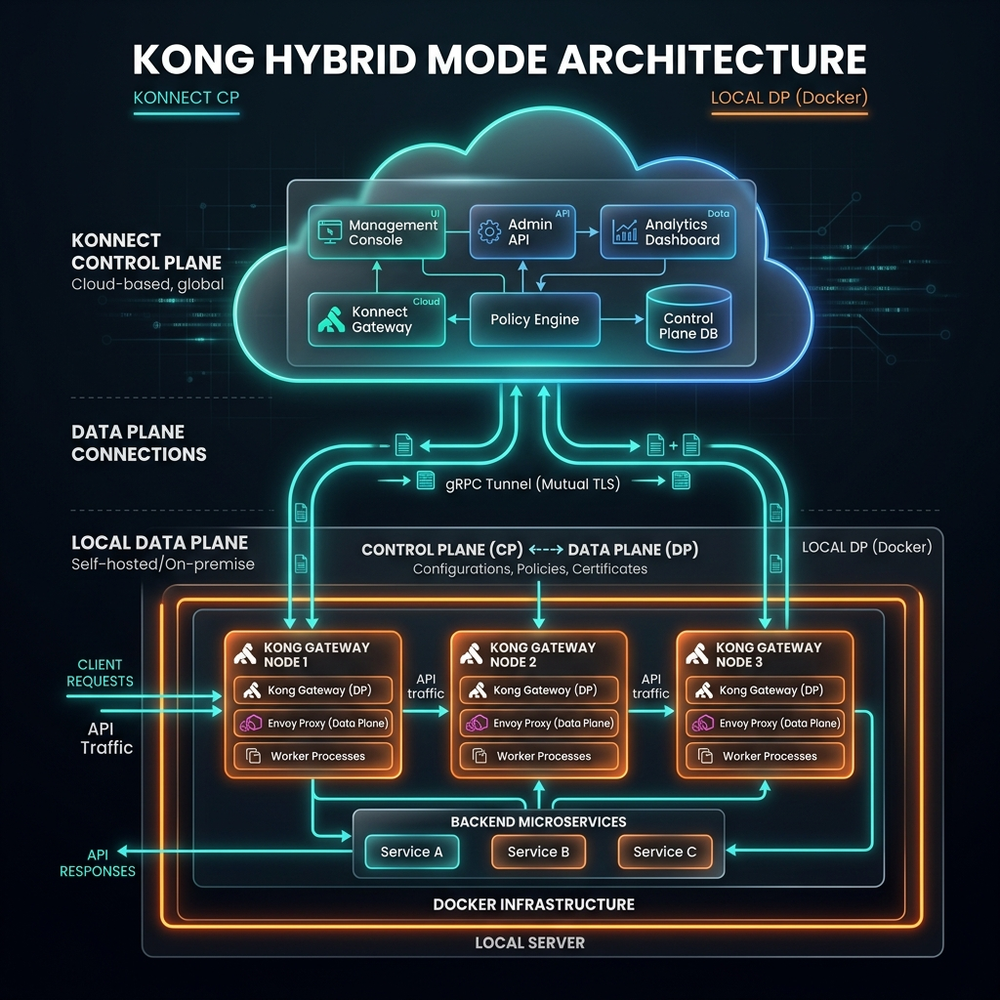

# Lab 01 (alternative) - Hybrid Docker Setup

> **Optional path.** Pick this lab if you want to see all the moving parts of a Kong deployment - running a Data Plane locally in Docker connected to a Konnect Control Plane over mTLS. Everything you do in [01-quick-start](./01-quick-start) works here too; the only difference is where the proxy runs.
>
> **Skip this lab if** you just want to learn Kong's concepts - go to [01-quick-start (serverless)](./01-quick-start) instead. You can always come back.



::: info Hybrid Architecture
**Control Plane (CP)** → Konnect cloud. Holds all configuration.
**Data Plane (DP)** → Your laptop (Docker). Handles all live API traffic.
The DP polls the CP for config changes over mTLS on port 443.

```
Client (you) → DP on localhost:8000 → upstream API
                       ↕  mTLS / 443
              Konnect CP (cloud.konghq.com)
```
:::

::: tip After setup
Once your DP is healthy and registered, the Service/Route/traffic steps are identical to [01-quick-start](./01-quick-start) - just substitute `http://localhost:8000` for the serverless proxy URL. Skip to "Step 7" there once you've completed Step 6 below.
:::

## Prerequisites

- [ ] Konnect account at [cloud.konghq.com](https://cloud.konghq.com) (free)
- [ ] Docker Desktop running with ≥ 4 GB RAM
- [ ] `KONNECT_TOKEN` environment variable set
- [ ] `curl`, `jq`, `decK` installed ([see Prerequisites](/prerequisites))

---

## Step 1 - Create a Control Plane in Konnect

1. Log in to [cloud.konghq.com](https://cloud.konghq.com)
2. In the left sidebar, click **API Gateway** → **Gateways**
3. Click **+ New Control Plane**
4. Choose **Kong Gateway** (Self-managed)
5. Name it: `bootcamp-cp`
6. Click **Create**

You'll land on the Control Plane dashboard. Note the **CP ID** in the URL - you'll need it.

---

## Step 2 - Generate Data Plane Certificates

1. In the Control Plane, click **Data Plane Nodes** → **New Data Plane Node**
2. Select **Docker**
3. Konnect generates a `docker run` command. **Copy the values for:**
   - `KONG_CLUSTER_CONTROL_PLANE` (e.g., `abc123.cp0.konghq.com:443`)
   - `KONG_CLUSTER_TELEMETRY_ENDPOINT` (e.g., `abc123.tp0.konghq.com:443`)
4. Under **Certificate**, click **Generate Certificate**
5. Download:
   - `tls.crt` → save to `~/kong-bootcamp/certs/tls.crt`
   - `tls.key` → save to `~/kong-bootcamp/certs/tls.key`

---

## Step 3 - Project directory & .env

```bash
mkdir -p ~/kong-bootcamp/certs
cd ~/kong-bootcamp

# Move your downloaded certs here
mv ~/Downloads/tls.crt certs/
mv ~/Downloads/tls.key certs/
```

Create `.env` (replace values from Step 2):

```bash
# .env - replace with your actual Konnect endpoints
KONNECT_CP_ENDPOINT=abc123def.cp0.konghq.com
KONNECT_TP_ENDPOINT=abc123def.tp0.konghq.com
```

---

## Step 4 - docker-compose.yml (Data Plane only)

```yaml
# docker-compose.yml
version: '3.8'

services:
  kong-dp:
    image: kong/kong-gateway:3.14
    container_name: kong-dp
    environment:
      # Hybrid / DB-less Data Plane settings
      KONG_ROLE: data_plane
      KONG_DATABASE: "off"

      # Konnect Control Plane connection
      KONG_CLUSTER_CONTROL_PLANE: "${KONNECT_CP_ENDPOINT}:443"
      KONG_CLUSTER_SERVER_NAME: "${KONNECT_CP_ENDPOINT}"
      KONG_CLUSTER_TELEMETRY_ENDPOINT: "${KONNECT_TP_ENDPOINT}:443"
      KONG_CLUSTER_TELEMETRY_SERVER_NAME: "${KONNECT_TP_ENDPOINT}"

      # mTLS certificates
      KONG_CLUSTER_CERT: /etc/secrets/tls.crt
      KONG_CLUSTER_CERT_KEY: /etc/secrets/tls.key

      # SSL & DNS
      KONG_LUA_SSL_TRUSTED_CERTIFICATE: system
      KONG_DNS_RESOLVER: ""

      # Logging
      KONG_PROXY_ACCESS_LOG: /dev/stdout
      KONG_PROXY_ERROR_LOG: /dev/stderr
      KONG_VITALS: "off"

    ports:
      - "8000:8000"   # Proxy HTTP  ← you'll send test traffic here
      - "8443:8443"   # Proxy HTTPS

    volumes:
      - ./certs:/etc/secrets:ro

    healthcheck:
      test: ["CMD", "kong", "health"]
      interval: 10s
      timeout: 5s
      retries: 10
      start_period: 20s

    restart: unless-stopped
```

---

## Step 5 - Start the Data Plane

```bash
docker compose up -d

# Watch startup logs
docker logs -f kong-dp
```

Look for this line to confirm the DP connected to Konnect:

```
[clustering] Data plane connected to control plane
```

---

## Step 6 - Verify the connection

### Check DP status in Konnect

Back in Konnect → **Data Plane Nodes**. Your node should show **Connected** with a green indicator.

### Check locally

```bash
# DP health (should return {"state": "green"})
docker exec kong-dp kong health

# Verify ports are open
curl -s http://localhost:8000/ | head -5
# {"message":"no Route matched with those values"}
# ↑ This is correct - no routes configured yet
```

---

## Step 7 - Configure decK to target Konnect

```bash
# Authenticate decK with your Konnect token
deck gateway ping \
  --konnect-token "$KONNECT_TOKEN" \
  --konnect-control-plane-name bootcamp-cp

# Expected:
# Successfully Konnect'd to Kong! (version: 3.14.x.x)
```

Save a `deck.yaml` helper so you don't repeat flags:

```yaml
# .deck.yaml (in your project root)
konnect-token: ${KONNECT_TOKEN}
konnect-control-plane-name: bootcamp-cp
```

---

## Step 8 - Explore Kong Manager in Konnect

Back in Konnect, navigate through:

| Section | What to explore |
|---|---|
| **Gateway Services** | All Services configured on this CP |
| **Routes** | URL path patterns that map to Services |
| **Plugins** | Enabled plugins (global, service-level, route-level) |
| **Consumers** | API consumers with credentials |
| **Data Plane Nodes** | Your running local DP |
| **Analytics** | Request traffic, latency, error rates |

---

## Port Reference

| Port | Service | Notes |
|---|---|---|
| `:8000` | Kong Proxy (HTTP) | Send your API requests here |
| `:8443` | Kong Proxy (HTTPS) | TLS termination |
| *(Konnect)* | Admin API | Via Konnect UI or decK - not exposed locally |

::: tip No Admin API port in Hybrid mode
In Hybrid mode, the DP has no local Admin API (`:8001`). All config goes through Konnect. Use `decK` or the Konnect UI to manage configuration.
:::

---

**Next:** Continue with [Lab 01 - Quick Start](./01-quick-start) from Step 4 (Create a Service). The Service/Route/traffic flow is identical - just substitute `http://localhost:8000` for the serverless proxy URL.

