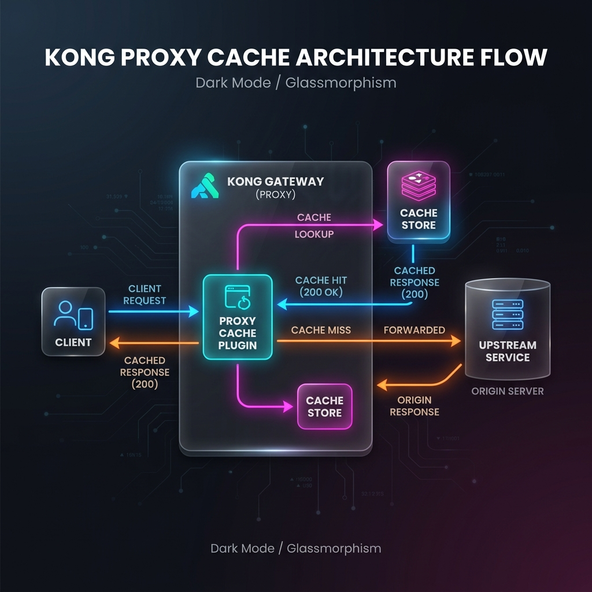

# Lab 04-B - Proxy Cache

> **Goal.** In ~25 minutes you'll attach `proxy-cache` to `flights-route`, watch a request hit the upstream once and then serve from Kong's memory for every subsequent identical request, and learn what NOT to cache.



Picking up from Lab 04-A - `flights-svc`, `flights-route`, three Consumers, `key-auth`, and per-Consumer `rate-limiting` are still in place.

---

## Step 1 - Establish a "cold" baseline (3 min)

Hit the route a few times and measure latency. Upstream is httpbin in another region, so first byte is typically 100–250ms.

```bash
for i in {1..5}; do
  curl -s -o /dev/null \
    -w '#%{http_code}  %{time_total}s\n' \
    $KONNECT_PROXY_URL/flights/get \
    -H 'X-API-Key: web-app-secret-key-001'
done
```

Expected (numbers vary):
```
#200  0.214s
#200  0.198s
#200  0.207s
#200  0.221s
#200  0.205s
```

Each request waits for httpbin to respond. The first request below 50ms is from network warmup or HTTP/2 reuse - but the upstream is hit every single time.

---

## Step 2 - Attach `proxy-cache` (3 min)

```yaml [Append to flights-route plugins]
- name: proxy-cache
  config:
    response_code: [200, 301, 404]   # which status codes are cacheable
    request_method: [GET, HEAD]      # only safe methods
    content_type: [application/json, application/json;charset=utf-8]
    cache_ttl: 60                    # seconds - short for the lab
    strategy: memory                 # in Kong's process memory
    cache_control: false             # ignore upstream Cache-Control
```

Sync. Wait 15s.

::: info `cache_control: false` vs `true`
- **`true` (default)**: Kong respects upstream `Cache-Control`, `Expires`, and `Pragma` headers. If httpbin sends `Cache-Control: no-store`, Kong won't cache. Right for production.
- **`false`** (this lab): Kong ignores upstream cache headers and caches everything that matches `response_code`/`request_method`/`content_type` for `cache_ttl` seconds. Useful when the upstream doesn't set sensible cache headers but you've audited the endpoint and know it's safe.
:::

---

## Step 3 - Watch cache hits (3 min) 🎯

Re-run the loop:

```bash
for i in {1..5}; do
  curl -s -D - -o /dev/null \
    -w '#%{http_code}  %{time_total}s\n' \
    $KONNECT_PROXY_URL/flights/get \
    -H 'X-API-Key: web-app-secret-key-001' \
    2>&1 | grep -iE '^(x-cache-status|#)'
done
```

Expected:
```
x-cache-status: Miss
#200  0.213s          ← first hit: upstream cold
x-cache-status: Hit
#200  0.008s          ← cached!
x-cache-status: Hit
#200  0.007s
x-cache-status: Hit
#200  0.009s
x-cache-status: Hit
#200  0.011s
```

🎯 The `X-Cache-Status` header tells you exactly what happened:
- **`Miss`** - first request, cache was empty, Kong forwarded to upstream and saved the response.
- **`Hit`** - subsequent requests, Kong returned the cached response in <10ms.
- **`Bypass`** - request wasn't cacheable (wrong method, wrong status, `Cache-Control: no-store`).
- **`Refresh`** - TTL expired, Kong fetched a fresh copy.

**✅ Checkpoint.** First request is `Miss` with high latency. The next 4 are `Hit` with single-digit ms.

---

## Step 4 - Inspect the cache (3 min)

Kong exposes the cache via Konnect Admin API. Look up the entry by its key:

```bash
# Find the cache key from the response header
CACHE_KEY=$(curl -s -I $KONNECT_PROXY_URL/flights/get \
  -H 'X-API-Key: web-app-secret-key-001' \
  | awk -F': ' '/^x-cache-key/{print $2}' | tr -d '\r')
echo "Cache key: $CACHE_KEY"
```

::: tip What's in the cache key?
By default the key is a hash of:
- Request **method**
- Request **path** (full, including query string)
- Plus optional fields you list under `vary_headers` / `vary_query_params`

If you have an API that returns different bodies per Consumer (most personalised APIs do), **the default key is wrong** - User A's response will be served to User B. Add `vary_headers: [X-Consumer-Id]` to the config so each Consumer's cache entry is isolated.
:::

---

## Step 5 - Force cache misses with the wrong method (3 min)

`POST` requests aren't in `request_method`. Kong skips the cache entirely:

```bash
curl -s -D - -o /dev/null -X POST \
  $KONNECT_PROXY_URL/flights/post \
  -H 'X-API-Key: web-app-secret-key-001' \
  -H 'Content-Type: application/json' \
  -d '{"a":1}' \
  2>&1 | grep -i x-cache-status
```

Expected: `x-cache-status: Bypass`

POSTs always reach the upstream. That's correct - caching writes would corrupt your data.

---

## Step 6 - Manual invalidation (4 min)

You changed something upstream and need to drop the cached copy without waiting 60 seconds for the TTL.

```bash
# List cache entries on the DP (Konnect serverless exposes this in the UI):
# Konnect → API Gateway → Gateways → your gateway → Plugins → proxy-cache → … not always available on serverless

# On a Konnect Admin API CP you can purge by cache key:
curl -X DELETE \
  -H "Authorization: Bearer $KONNECT_TOKEN" \
  "https://${KONNECT_REGION}.api.konghq.com/v2/control-planes/${KONNECT_CP_ID}/proxy/caches/$CACHE_KEY"
```

Then the next request should be `Miss` again.

::: info Serverless caveat
Konnect serverless DPs may not expose direct cache-purge endpoints. Practical alternatives:
- **Short `cache_ttl`** (seconds-to-low-minutes) so stale data ages out naturally.
- **`vary_headers`** trick: include a version header (`X-Cache-Bump: v2`) clients can change to force a new key.
- **Delete-and-recreate** the plugin to wipe everything.
:::

---

## Step 7 - What NOT to cache (3 min - read, don't run)

Caching is dangerous when you misjudge a response's shape. Don't cache:

| Endpoint pattern | Reason | What instead |
|---|---|---|
| `/me`, `/profile`, anything per-user | Per-user data - wrong user gets wrong data | If you must cache, key by Consumer ID via `vary_headers` |
| Anything with `Authorization: Bearer …` | Tokens change per request; cached copy stays | Don't cache, or vary on `Authorization` |
| Writes (`POST`, `PUT`, `DELETE`, `PATCH`) | Side-effects - would lose data | Restrict `request_method: [GET, HEAD]` |
| `5xx` responses | Caching errors creates a feedback loop | Set `response_code: [200, 301, 404]` only |
| `Set-Cookie` responses | Cookies are per-session | Strip cookies or skip caching |

::: warning The classic outage
A team caches `GET /users/me` with the default config and `cache_ttl: 3600`. For one hour after deployment, every user sees the first user's profile. The fix: `vary_headers: [Authorization]` and a hard CI test that hits `/me` as two different users.
:::

---

## Recap

- `proxy-cache` keys by method + path. Add `vary_headers` for any per-user content.
- Watch `X-Cache-Status` to confirm Hit / Miss / Bypass.
- Short `cache_ttl` is your friend during the rollout - bumps to longer values later.
- Plugin order matters: `rate-limiting` runs *before* `proxy-cache` so cached responses still count.

---

## Cleanup - full M04 wipe

```bash
echo '_format_version: "3.0"' | deck gateway sync - \
  --konnect-token $KONNECT_TOKEN \
  --konnect-control-plane-name $KONNECT_CP_NAME
```

---

**Next:** [Module 05 - Transformations →](/module-05-transformations/) - reshape requests and responses in flight. Strip sensitive fields. Add headers your upstream expects. Rename query params during a migration.

