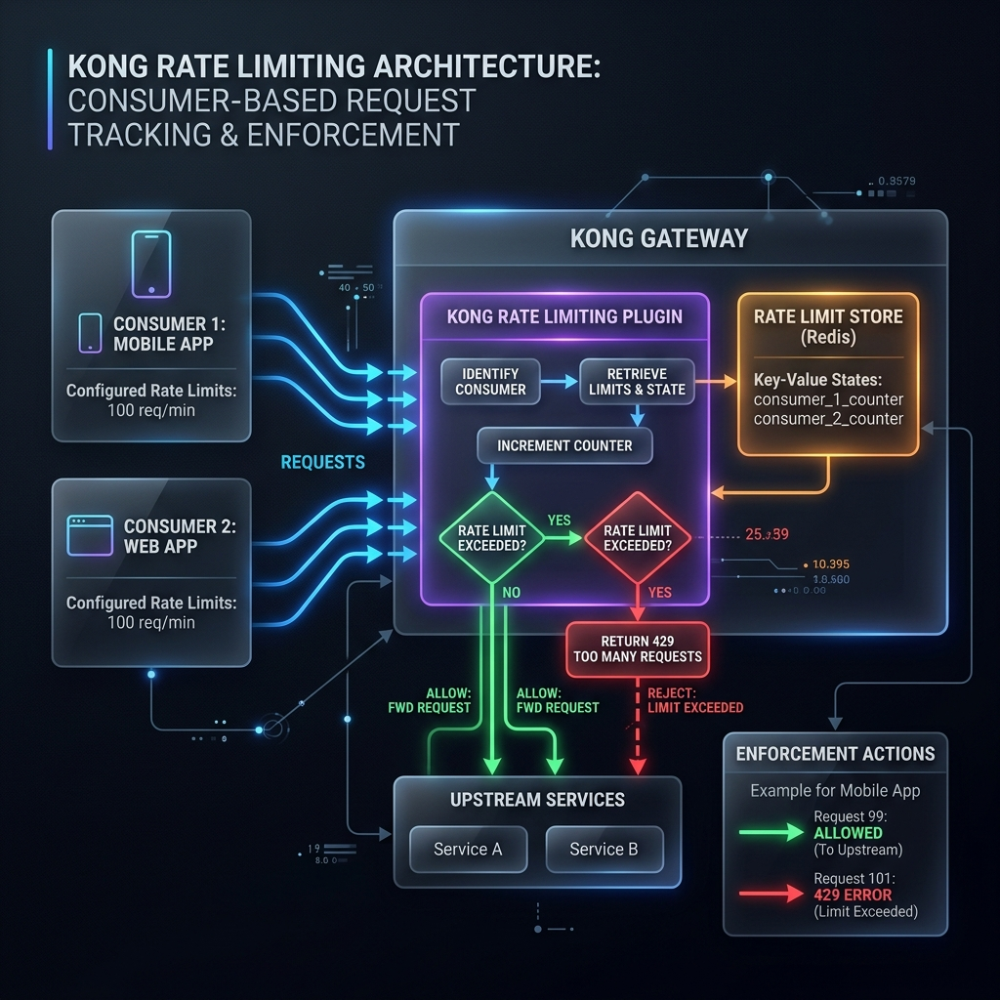

# Lab 04-A - Rate Limiting

> **Goal.** In ~35 minutes you'll attach `rate-limiting` to `flights-route`, watch counters update in the response headers, deliberately exceed the limit (HTTP 429), and learn how to set **different limits for different Consumers**.



::: tip Picking up from M03
Make sure the M03 cleanup ran. We start from an empty CP.

```bash
echo "Token: ${KONNECT_TOKEN:0:8}…  CP: $KONNECT_CP_NAME  Proxy: $KONNECT_PROXY_URL"
```
:::

---

## Step 1 - Rebuild the baseline (3 min)

Same shape as M03: Service + Route + three Consumers (one anonymous, two with API keys) + `key-auth` on the route.

```yaml [kong.yaml]
_format_version: '3.0'

consumers:
  - username: anonymous
    tags: [module-04]
  - username: web-app
    custom_id: web-001
    keyauth_credentials:
      - key: web-app-secret-key-001
    tags: [module-04]
  - username: mobile-app
    custom_id: mobile-001
    keyauth_credentials:
      - key: mobile-app-secret-key-002
    tags: [module-04]

services:
  - name: flights-svc
    url: https://httpbin.konghq.com
    tags: [module-04]
    routes:
      - name: flights-route
        paths: [/flights]
        strip_path: true
        plugins:
          - name: key-auth
            config:
              key_names: [X-API-Key]
              hide_credentials: true
              anonymous: <PASTE-ANONYMOUS-CONSUMER-UUID>   # see Step 2
```

Sync, but **don't run yet** - we'll fix the anonymous UUID first.

```bash
deck gateway sync kong.yaml \
  --konnect-token $KONNECT_TOKEN \
  --konnect-control-plane-name $KONNECT_CP_NAME
```

### Step 1.1 - Get the anonymous Consumer's UUID

```bash
ANON_ID=$(curl -s -H "Authorization: Bearer $KONNECT_TOKEN" \
  "https://${KONNECT_REGION}.api.konghq.com/v2/control-planes/${KONNECT_CP_ID}/core-entities/consumers/anonymous" \
  | jq -r '.id')
echo "Anonymous: $ANON_ID"
sed -i.bak "s/<PASTE-ANONYMOUS-CONSUMER-UUID>/$ANON_ID/" kong.yaml
deck gateway sync kong.yaml \
  --konnect-token $KONNECT_TOKEN \
  --konnect-control-plane-name $KONNECT_CP_NAME
```

**✅ Checkpoint.** With no key: `$KONNECT_PROXY_URL/flights/get` → 200, `X-Consumer-Username: anonymous`. With `X-API-Key: web-app-secret-key-001` → 200, `X-Consumer-Username: web-app`.

---

## Step 2 - Attach a basic rate-limit (5 min)

10 requests per minute, identifier = consumer (each Consumer has its own bucket).

```yaml [Append plugin to flights-route]
- name: flights-route
  paths: [/flights]
  strip_path: true
  plugins:
    - name: key-auth
      config: { … }
    - name: rate-limiting
      config:
        minute: 10
        policy: local              # per-node (fine for one DP)
        limit_by: consumer
        fault_tolerant: true
        hide_client_headers: false
```

Sync, wait 15s.

::: tip `policy` values, briefly
- **`local`** - counters in node memory. Fastest. Each DP counts independently. Good for single-DP deployments.
- **`cluster`** - counters in Kong's DB. Shared across all DPs. Slower (DB round-trip). Not available in DB-less mode.
- **`redis`** - counters in a shared Redis. Best for production multi-DP. Needs a Redis instance.

For a serverless Konnect gateway you'll typically use `redis` once you're at scale; for this lab `local` is fine.
:::

**✅ Checkpoint.** Konnect → flights-route → Plugins → `rate-limiting` listed.

---

## Step 3 - Watch the headers (3 min)

```bash
curl -sI $KONNECT_PROXY_URL/flights/get -H 'X-API-Key: web-app-secret-key-001' \
  | grep -iE '^(http|x-ratelimit)'
```

Expected (abbreviated):
```
HTTP/2 200
x-ratelimit-limit-minute: 10
x-ratelimit-remaining-minute: 9
ratelimit-limit: 10
ratelimit-remaining: 9
ratelimit-reset: 47
```

🎯 Kong returned **two flavors** of the same headers:
- `X-RateLimit-*` - Kong's historical format.
- `RateLimit-*` (no prefix) - the IETF draft standard adopted in Kong 3.x.

Send a few more in quick succession - `remaining` ticks down.

---

## Step 4 - Trip the limit (5 min) 🧪

Smash the route 12 times in a row (above the 10/min limit):

```bash
for i in {1..12}; do
  curl -sI $KONNECT_PROXY_URL/flights/get \
    -H 'X-API-Key: web-app-secret-key-001' \
    | head -1
done
```

Expected:
```
HTTP/2 200   x10
HTTP/2 429   x2
```

```bash
curl -i $KONNECT_PROXY_URL/flights/get -H 'X-API-Key: web-app-secret-key-001' | head -5
# HTTP/2 429
# retry-after: 31
# x-ratelimit-remaining-minute: 0
# {"message":"API rate limit exceeded"}
```

::: info `Retry-After` is a contract
A well-behaved client sees `429` + `Retry-After: 31` and **waits 31 seconds** before trying again. A badly-behaved client retries immediately, burns its bucket again, and gets stuck. Build clients that honour `Retry-After` - it's the difference between a brownout and an outage.
:::

**✅ Checkpoint.** You triggered a 429, observed `Retry-After`, and the next-minute traffic flows again.

---

## Step 5 - Per-Consumer limits (10 min) 🧪

`web-app` should get 100/min. `mobile-app` should get 300/min. Anonymous stays at 10/min.

Kong doesn't support per-Consumer limits in *one* plugin instance - instead you attach separate `rate-limiting` instances scoped to each Consumer.

```yaml [Append Consumer-scoped plugins]
plugins:
  # Anonymous: 10/min (the existing one, but scoped to anonymous now)
  - name: rate-limiting
    config:
      minute: 10
      policy: local
      limit_by: consumer
    consumer: anonymous
    route: flights-route

  - name: rate-limiting
    config:
      minute: 100
      policy: local
      limit_by: consumer
    consumer: web-app
    route: flights-route

  - name: rate-limiting
    config:
      minute: 300
      policy: local
      limit_by: consumer
    consumer: mobile-app
    route: flights-route
```

::: warning Move the old route-scoped plugin out
You had a single `rate-limiting` under `flights-route`'s `plugins:` block. Remove it - the three Consumer-scoped instances above replace it. Two overlapping rate-limit plugins on the same request produce confusing maths.
:::

Sync. Wait 15s. Verify each Consumer's limit:

```bash
echo "── anonymous ──"
curl -sI $KONNECT_PROXY_URL/flights/get | grep -i 'ratelimit-limit-minute'

echo "── web-app ──"
curl -sI $KONNECT_PROXY_URL/flights/get -H 'X-API-Key: web-app-secret-key-001' \
  | grep -i 'ratelimit-limit-minute'

echo "── mobile-app ──"
curl -sI $KONNECT_PROXY_URL/flights/get -H 'X-API-Key: mobile-app-secret-key-002' \
  | grep -i 'ratelimit-limit-minute'
```

Expected:
```
── anonymous ──
x-ratelimit-limit-minute: 10
── web-app ──
x-ratelimit-limit-minute: 100
── mobile-app ──
x-ratelimit-limit-minute: 300
```

::: tip Why scope the plugin to **both** consumer and route?
Without `route:`, the plugin would limit that Consumer **globally** (all routes). Pinning to a specific Route is how you build per-tier-per-endpoint limits: free Consumer gets 10/min on /flights but 100/min on /weather.
:::

**✅ Checkpoint.** Each Consumer reports a different limit in the response headers.

---

## Step 6 - Switch the identifier from consumer to IP (5 min) 🧪

Sometimes you want to throttle by source IP regardless of who's authenticated. Drop the anonymous-scoped plugin and replace it with an IP-based one - useful when you want **anyone hammering you from a single IP to share one bucket**, even if they're rotating Consumer credentials.

```yaml
- name: rate-limiting
  config:
    minute: 30
    policy: local
    limit_by: ip      # ← was consumer
  route: flights-route
```

Sync, wait 15s. Now:
- All 30 requests/minute originating from your IP share the same bucket.
- Even if you switch between `X-API-Key` values, your IP is still throttled together.

```bash
for KEY in '' 'web-app-secret-key-001' 'mobile-app-secret-key-002'; do
  curl -sI $KONNECT_PROXY_URL/flights/get \
    ${KEY:+-H "X-API-Key: $KEY"} \
    | grep -iE '^(x-consumer-username|x-ratelimit-remaining-minute)'
done
```

Notice **`remaining` keeps decreasing across keys** - same IP, one bucket.

Revert to `limit_by: consumer` before the next lab.

::: info When to use which identifier
| Identifier | Best when |
|---|---|
| `consumer` | You've already done auth; per-tier limits |
| `ip` | Pre-auth abuse protection, anti-scraper |
| `credential` | API key holders, even if same Consumer (rotating keys → separate buckets) |
| `header` | Throttle by an arbitrary header (tenant ID, device ID) |
| `path` | Throttle by the matched route's path, ignoring identity |
:::

---

## Recap

- `rate-limiting` is one plugin, multiple instances. Attach scoped to Route + Consumer for per-tier limits.
- Plugin returns `429` + `Retry-After` - well-behaved clients respect both.
- `limit_by: ip` and `limit_by: consumer` answer different questions. Pick deliberately.
- `policy: local` is per-DP; use `redis` for cross-DP accuracy.

**`rate-limiting-advanced`** (sliding windows, Redis, namespacing for shared limits across Services) is a Konnect Enterprise plugin - covered in M07.

---

## Cleanup

**Don't clean up yet.** Lab 04-B reuses the Service/Route. Full M04 cleanup at the end of 04-B.

---

**Next:** [Lab 04-B - Proxy Cache →](./04-proxy-cache)

