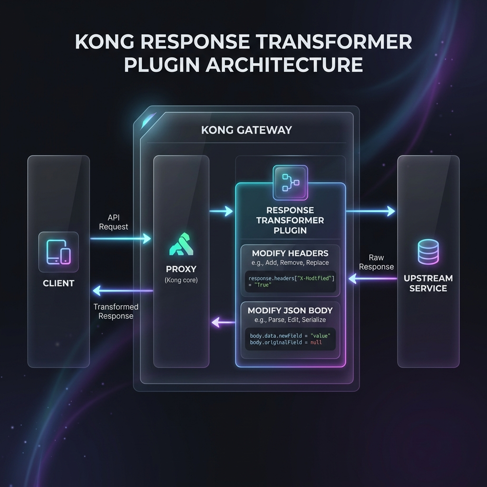

# Lab 05-B - Response Transformer

> **Goal.** In ~30 minutes you'll attach `response-transformer-advanced` to `flights-route` and rewrite responses before they leave the gateway. You'll strip internal fields, add metadata, and make a transform fire **only for certain status codes**.



Picking up from Lab 05-A - request transformer is in place, baseline still works.

---

## Step 1 - See the unfiltered response (2 min)

httpbin echoes everything back. We'll treat httpbin's `/anything` endpoint as our "upstream" and pretend the JSON it returns is from your real backend.

```bash
curl -s $KONNECT_PROXY_URL/flights/anything \
  -H 'X-API-Key: web-app-secret-key-001' \
  | jq 'keys'
```

You'll see fields like `args`, `data`, `files`, `form`, `headers`, `json`, `method`, `origin`, `url`. Pretend `headers` and `origin` are internal-only fields you don't want clients to see.

---

## Step 2 - Add a response header (3 min)

```yaml [Append plugin to flights-route]
plugins:
  - name: key-auth
    config: { … }
  - name: request-transformer-advanced
    config: { … }
  - name: response-transformer-advanced
    config:
      add:
        headers:
          - "X-Bootcamp-Module:05"
          - "X-Powered-By:Kong"
```

Sync. Wait 15s.

```bash
curl -sI $KONNECT_PROXY_URL/flights/anything \
  -H 'X-API-Key: web-app-secret-key-001' \
  | grep -iE '^(x-bootcamp-module|x-powered-by)'
```

Expected:
```
x-bootcamp-module: 05
x-powered-by: Kong
```

🎯 Client sees these headers, upstream doesn't (Kong added them on the way out).

---

## Step 3 - Remove fields from the JSON body (5 min) 🎯

Httpbin's `headers` field contains everything Kong forwarded - including the `X-Tenant-Id`, `X-Calling-User` we added in 05-A. Pretend that's sensitive internal metadata. Hide it from the client.

```yaml
- name: response-transformer-advanced
  config:
    add:
      headers: [ … ]
    remove:
      json:
        - headers           # delete the entire headers object
        - origin            # delete the origin field
```

Sync.

```bash
curl -s $KONNECT_PROXY_URL/flights/anything \
  -H 'X-API-Key: web-app-secret-key-001' \
  | jq 'keys'
```

Expected: `headers` and `origin` are **gone** from the response body. The upstream sent them; Kong stripped them on the way out.

::: tip `remove.json` and nested keys require `dots_in_keys: false`
By default (`dots_in_keys: true`) the plugin treats dots as **literal key-name characters**, so `_meta.version` is a flat key `"_meta.version": "v3"` - not a nested object. Set `dots_in_keys: false` to make dot-notation navigate nested objects: `remove.json: ["data.user.ssn"]` then deletes `body.data.user.ssn`.
:::

---

## Step 4 - Add fields to the body (3 min)

You want every response to carry an envelope: `{ "data": {...}, "_meta": { "version": "v3", "served_by": "kong" } }`.

```yaml
- name: response-transformer-advanced
  config:
    dots_in_keys: false   # treat dots as path separators so _meta.version → {_meta:{version:…}}
    add:
      headers: [ … ]
      json:
        - "_meta.version:v3"            # creates nested _meta.version
        - "_meta.served_by:kong"
    remove:
      json: [ … ]
```

Sync.

```bash
curl -s $KONNECT_PROXY_URL/flights/anything \
  -H 'X-API-Key: web-app-secret-key-001' \
  | jq '._meta'
# { "version": "v3", "served_by": "kong" }
```

🎯 Without changing your upstream, every response now has consistent metadata.

---

## Step 5 - Conditional transforms by status code (5 min) 🧪

You only want to add `_meta` to **successful** responses. For 4xx/5xx errors, the body is already a Kong-generated error object - adding `_meta.version` to that would be confusing.

```yaml
- name: response-transformer-advanced
  config:
    dots_in_keys: false
    add:
      if_status: ["200-299"]    # ← only apply when upstream returned 2xx
      headers: [ … ]
      json: [ "_meta.version:v3", "_meta.served_by:kong" ]
    remove:
      if_status: ["200-299"]
      json: [headers, origin]
```

Sync. Test on a success:

```bash
curl -s $KONNECT_PROXY_URL/flights/anything \
  -H 'X-API-Key: web-app-secret-key-001' \
  | jq '._meta'
# { "version": "v3", "served_by": "kong" }
```

Force a 4xx (no API key):

```bash
curl -s $KONNECT_PROXY_URL/flights/anything | jq
# {"message":"No API key found in request","request_id":"..."}
# ← No _meta added - exactly what we want
```

🎯 The same plugin behaves differently based on upstream status.

::: info Status patterns - exact codes and numeric ranges only
Kong's `if_status` accepts **exact status codes** or **numeric ranges** separated by `-`:
- `"200-299"` - any 2xx success response
- `"200"` - exactly 200
- `"404"` - exactly 404
- `"500-599"` - any 5xx error response

**Not supported:** `2XX`, `4xx`, `>=500` shorthand patterns.
:::

---

## Step 6 - Replace and rename (4 min)

```yaml
- name: response-transformer-advanced
  config:
    add:     { … }
    remove:  { … }
    replace:
      if_status: ["200-299"]
      json:
        - "url:[REDACTED]"          # overwrite the url field
```

Sync.

```bash
curl -s $KONNECT_PROXY_URL/flights/anything \
  -H 'X-API-Key: web-app-secret-key-001' \
  | jq '{url}'
```

Expected:
```json
{ "url": "[REDACTED]" }
```

🎯 Value replaced in the response body without touching the upstream.

---

## Step 7 - When NOT to transform responses (3 min - read)

| Situation | Why caution |
|---|---|
| Streaming responses (NDJSON, SSE, websockets) | Transformers buffer the full body in memory - bad for streams |
| Very large bodies (>~10 MB by default) | Memory pressure; configure `max_body_size` |
| Binary bodies (images, PDFs) | Transformer expects JSON or text content-type; you get gibberish or errors |
| Already-cached responses | `proxy-cache` caches **after** response transformation - if you change the transformer config later, old cache entries still have the old shape until TTL expires |

::: warning Cache + transformer order
The cache plugin caches what the client would see, post-transform. If you change the transformer, **invalidate the cache** (see M04-B) or wait for TTL. Otherwise clients keep seeing the old shape.
:::

---

## Recap - what you can now do

| Verb | Use case |
|---|---|
| `add.headers` | Inject metadata for the client (versioning, request IDs) |
| `add.json` | Wrap responses in an envelope without backend changes |
| `remove.json` | Strip internal fields, debug data, sensitive PII |
| `replace.json` | Redact field values without removing the key |
| `rename.json` | Migrate field names during an API version transition |
| `if_status` | Apply transforms only on specific status codes |

Combined with `request-transformer-advanced` from 05-A, you can perform a full v2-to-v3 API migration **at the gateway layer**, with the backend untouched. Most teams call this an **adapter pattern**.

---

## Exit ticket - answers

1. **Inject per-Consumer header.** `request-transformer-advanced` plugin, `add.headers` operation, `$(headers["x-consumer-custom-id"])` template variable (key-auth injects `X-Consumer-Custom-Id` before the transformer runs). Or `replace.headers` if you want to override any client-supplied value.
2. **Force upstream to ignore client `Cache-Control`.** `request-transformer-advanced`, `remove.headers: [Cache-Control]`. Removes the header before forwarding.
3. **Strip `_debug` from response.** `response-transformer-advanced`, `remove.json: [_debug]`. For nested paths use dot notation: `data.user._debug`.

---

## Cleanup - full M05 wipe

```bash
echo '_format_version: "3.0"' | deck gateway sync - \
  --konnect-token $KONNECT_TOKEN \
  --konnect-control-plane-name $KONNECT_CP_NAME
```

---

**Next:** [Module 06 - Observability →](/module-06-observability/) - make your gateway's traffic visible. Stream logs, scrape metrics, distributed traces.

