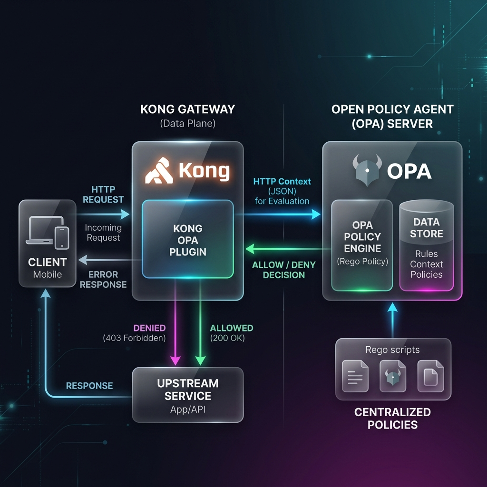

# Lab 07-E - OPA Policy-as-Code

> **Goal.** In ~45 minutes you'll set up Open Policy Agent (OPA) alongside Kong, write a Rego policy that says "only Consumers with `tier=enterprise` can `POST /flights/premium`", and watch Kong defer the allow/deny decision to OPA on every request.
>
> **Why OPA instead of `acl`?** ACL is a static allowlist by group. OPA is a **policy engine** - it can read request headers, body, time-of-day, even external HTTP data, then return allow/deny. The security team can change policies without re-deploying gateway config.



::: warning Enterprise plugin
`opa` requires **Kong Gateway Enterprise** or **Konnect**. We're on Kong 3.14, so this works.
:::

## How OPA Works with Kong

```
Request arrives at Kong →
  opa plugin forwards request context as JSON to OPA →
    OPA evaluates Rego policy →
      { "result": true }  → Kong proxies request
      { "result": false } → Kong returns 403 Forbidden
```

Kong sends the full request context (method, path, headers, query, consumer, service) to OPA's REST API. Your Rego policy decides allow/deny.

## Step 1 - Start OPA

```bash
# Run OPA as a sidecar (add to docker-compose, or run standalone)
docker run -d --name opa \
  -p 8181:8181 \
  openpolicyagent/opa:latest \
  run --server --addr :8181

# Verify OPA is running
curl -s http://localhost:8181/v1/health | jq .
# { "status": "ok" }
```

::: tip Docker network for hybrid mode
If Kong runs as a Docker container (hybrid mode), OPA must be on the same network or use `host.docker.internal` as the host:
```bash
docker run -d --name opa --network kong-net \
  -p 8181:8181 openpolicyagent/opa:latest run --server --addr :8181
```
When configuring the plugin, use `opa_host: opa` (Docker service name) instead of `localhost`.
:::

## Step 2 - Write a Rego policy

Create `policy.rego`:

```go
package myapp.authz

default allow = false

# Allow authenticated GET requests
allow {
  input.request.http.method == "GET"
  input.consumer.username != ""
}

# Allow admin consumers full access
allow {
  input.consumer.username == "travel-mobile-app"
}

# Block requests without a consumer (unauthenticated)
allow {
  input.consumer != null
  input.request.http.method == "GET"
}
```

## Step 3 - Load the policy into OPA

```bash
# Push policy to OPA via REST API
curl -s -X PUT http://localhost:8181/v1/policies/myapp \
  -H "Content-Type: text/plain" \
  --data-binary @policy.rego

# Verify policy loaded
curl -s http://localhost:8181/v1/policies | jq '.result[].id'
# "myapp"
```

## Step 4 - Apply the OPA plugin to `flights-route`

::: code-group

```yaml [decK YAML]
services:
  - name: flights-svc
    routes:
      - name: flights-route
        plugins:
          - name: opa
            tags: [module-07]
            config:
              opa_protocol: http
              opa_host: host.docker.internal   # use Docker service name in hybrid mode
              opa_port: 8181
              opa_path: /v1/data/myapp/authz/allow
              include_consumer_in_opa_input: true
              include_service_in_opa_input:  true
              ssl_verify: false
```

```bash [Konnect Admin API]
ROUTE_ID=$(curl -s \
  -H "Authorization: Bearer $KONNECT_TOKEN" \
  "https://${KONNECT_REGION}.api.konghq.com/v2/control-planes/${KONNECT_CP_ID}/core-entities/routes/flights-route" \
  | jq -r '.id')

curl -s -X POST \
  -H "Authorization: Bearer $KONNECT_TOKEN" \
  -H "Content-Type: application/json" \
  "https://${KONNECT_REGION}.api.konghq.com/v2/control-planes/${KONNECT_CP_ID}/core-entities/routes/${ROUTE_ID}/plugins" \
  -d '{
    "name": "opa",
    "tags": ["module-07"],
    "config": {
      "opa_protocol": "http",
      "opa_host": "host.docker.internal",
      "opa_port": 8181,
      "opa_path": "/v1/data/myapp/authz/allow",
      "include_consumer_in_opa_input": true,
      "include_service_in_opa_input": true,
      "ssl_verify": false
    }
  }' | jq '{id, name}'
```

:::

## Step 5 - Test allow and deny

```bash
# Authenticated consumer (key-auth also enabled) → allowed by Rego policy
curl -si $KONNECT_PROXY_URL/flights/get \
  -H "X-API-Key: pro-key-001" | head -3
# HTTP/2 200

# No credentials → denied by Rego (consumer.username is empty)
curl -si $KONNECT_PROXY_URL/flights/get | head -3
# HTTP/2 403
```

## Step 6 - Inspect the OPA input payload

```bash
# Manually simulate what Kong sends to OPA
curl -s -X POST http://localhost:8181/v1/data/myapp/authz/allow \
  -H "Content-Type: application/json" \
  -d '{
    "input": {
      "request": {
        "http": {
          "method": "GET",
          "path": "/flights/get",
          "headers": {}
        }
      },
      "client_ip": "10.0.0.1",
      "consumer": { "username": "pro-user-001" },
      "service": { "name": "flights-svc" }
    }
  }' | jq .
# { "result": true }
```

## OPA Input Structure

Kong sends the following JSON to OPA on every request:

```json
{
  "input": {
    "request": {
      "http": {
        "method": "GET",
        "path": "/flights/get",
        "headers": { "authorization": "Bearer ..." },
        "querystring": {}
      }
    },
    "client_ip": "10.0.0.5",
    "consumer": { "id": "...", "username": "pro-user-001" },
    "service": { "name": "flights-svc" }
  }
}
```

## Configuration Reference

| Parameter | Default | Description |
|---|---|---|
| `opa_host` | `localhost` | OPA server hostname |
| `opa_port` | `8181` | OPA server port |
| `opa_path` | - | OPA data/rule API path (e.g. `/v1/data/myapp/authz/allow`) |
| `https` | `false` | Use HTTPS to connect to OPA |
| `ssl_verify` | `true` | Verify OPA server TLS certificate |
| `include_consumer_in_opa_input` | `false` | Include authenticated Consumer data in OPA payload |
| `include_service_in_opa_input` | `false` | Include Kong Service object in OPA payload |
| `include_route_in_opa_input` | `false` | Include Kong Route object in OPA payload |
| `include_uri_captures_in_opa_input` | `false` | Include regex capture groups from the Route path |

---

*Previous: [Lab 07-D - Upstream OAuth](./07-upstream-oauth) · Next: [Lab 07-F - Datakit →](./07-datakit)*

